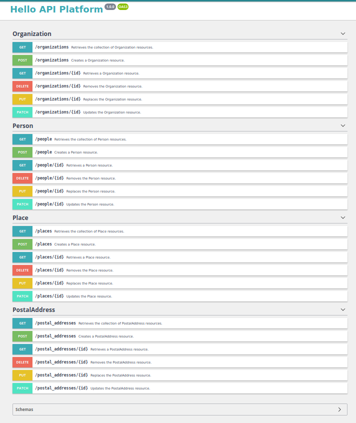
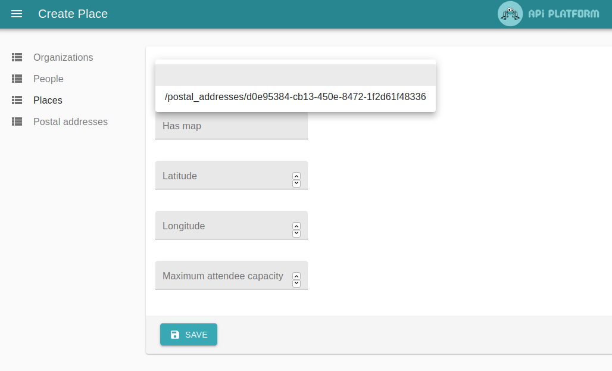

# Notes prises en main API PLatform

## Pourquoi API plateform

Experience du jobboard en js : mise en place d'openAPI, volonté de coller aux standards schema, opendata ... Très long à mettre en place from scratch avec toutes les bonnes pratiques.
API Platform à tout ça "nativement" : 

* OpenAPI
* json et JSON-LD
* génération du modèle depuis schema.org
* un ORM (bon ça ce discutte ! mais ca va vite)
* du graphQL pour offrir une bon pannel
* Mercure (pour quoi faire ! pas tester)
* Vulcain (pas encore tester non plus)
* Et à priori un bon environnement de dev (tests, génération de fixtures, ...)

Mais pour résumer, un framework exploitant à bloque les standard web, avec des brique de "linked data" fondatrices d'une démarche de décentralisation. So, let's go !

## Le Hello world
Quelques problèmes (sur le graphql avec nécessité d'intervenir sur un bundle, des tests capricieux, pas de linter de facto comme le serait Eslint, quel standard appliqué, ... mais bon, y'a un bout que je fais plus de Php :( ).
Mais globallement très convaincant !

## Création des modèles des CaenCamp

### Mise en place d'un premier schema depuis schema.org.
Ok, bonnant malan, en virant certaines props experimentales que l'outils de génération n'arrivait pas à gérer.
Problème avec les uuid (le fonction n'est pas disponible dans la db fournie dans le docker-compose) du coup je suis repassé aux id incrémentaux pour le moment.
Le modèle est franchement explosé en plein d'objets.

Next steps : 

* régler le problème des uuid
* simplifier le modèle pour avoir moins d'objets à gérer
* Faire mieux coller le modèle au données existantes de CaenCamp
* Reprendre les interface auto-générer de react-admin
* bosser les validations (tester par exemple la génératoin des json-schema des objets !)
* faire un script pour importer les données existantes
* faire un générateur de fixtures avec le bundle truc truc.

Et puis pour le "lancement du projet"

* Makefile
* Linter et githook
* Readme
* Open-sourcing
* tests
* intégration continue

## Problème de l'uuid

1) Ajout d'un sql.init dans le repertoire docker et montage du script dans le docker-compose
2) Ajout de la conf des uuid dans le schema.yaml

It's working \o/

## Amélioration du modèle

Pour le moment, en schema.json bête et méchant :

* CreativeWork
* Event
* MediaObject
* Organization
* Person
* Place
* PostalAddress

Pour coller aux données existantes et au "métier" des CCC, on pourrait plutôt avoir :

### Un event / un évènement

Donc un event pourrait avoir un 
* type (talk, lightning, coding ...)
* un ou plusieurs speakers de type Person
* un lieu / Place
* un organisateur (CaenCamp / Devops CaenCamp / Coding CaenCamp)

Mais en vrai, on devrait avoir une distinction entre l'évènement et les sessions qu'il contient. Par exemple pour une édition des CaenCamp, on doit pouvoir avoir un Talk et un lightning ! => Fouiller les sur/sous évènements de schema.org !

On doit aussi pouvoir associer une ou plusieurs photos et une ou plusieurs vidéos à un event. En fait, plusieur CreativeWork qui pourraient-être de plusieurs types (audio - vidéos - photos - slides ...)

### Une organization / Boite

Une personne peut travailler pour une boite
Une boite peut être sponsor
Une boite peut prêter un lieu (Place)

### Une personne

Une personne peut travailler dans une boite
Une personne peut faire un event (sous-event)

### Des médias

CreativeWork associés à des events

### Un lieu

Un lieu correspond à un lieux physique et donc à une adresse postale.
Un lieu peut accueillir un évènement en tant que tel, mais un lieu peut aussi être associer à une boite.

## Stop, on arrête, et c'est pas grave !

Bon premier conseil, ne pas essayer de tout faire dès le début ! Allons-y entité par ententé... 
Donc je me concentre dans un premier temps sur les personnes et les organization, les boites ...

Voila le schema tiré de schema.org

```yaml
id:
  generationStrategy: uuid
validator:
  assertType: true
types:
  PostalAddress:
    properties:
      addressCountry: { range: "Text" }
      addressLocality: ~
      postalCode: ~
      streetAddress: ~
  Place:
    properties:
      address: { range: "PostalAddress" }
      hasMap: { range: "URL" }
      latitude: { range: "Number" }
      longitude: { range: "Number" }
      maximumAttendeeCapacity: ~
  Organization:
    properties:
      name: ~
      description: ~
      disambiguatingDescription: ~
      image: ~
      url: ~
      location: { range: "Place" }
      email: ~
      employees:
        cardinality: "(0..*)"
        range: "Person"
  Person:
    properties:
      additionalName: ~
      familyName: ~
      givenName: ~
      honorificPrefix: ~
      description: ~
      disambiguatingDescription: ~
      image: ~
      url: ~
      memberOf: { range: "Organization" }

```

Deux remarques : 
* l'uuid avec le tips de db.init
* la relation `employees` avec un cardinality de (0..*) pour définir un array d'employées de type Person

Voyons le résultat :

Une doc complète (c'est chouette), mais avec des objets dont on ne veut pas de routes d'API : PostalAddress et Place 



Autre problème : La relation entre une adresse, une place et un organisations se fait via des url (logique, mais chiant).
Du coup, 3 call pour une organization complète.
Et côté RA, besoins de creer une adresse puis un lieux puis un organisation, et difficile de les lier entre eux via des url pointant vers la ressource qui ne sont pas très lisible.



Ceci dit la relation entre les objet se fait quand même très bien. 
! Par contre la relation employees d'une organisation ne passe pas par la même table/relation que celle lien une personne à une organization !
** Il faudra trouver une solution pour ça ! **

Non, ce que je veux, c'est juste de la doc pour le CRUD des personnes et des organizations Lorsque l'on créer un organisation, on doit créer en même temps l'adresse postale et le lieux. Mais il faut que cela reste de la donnée liée sur le json-ld ! 

Comment faire ça ? 

Premiere approche en séparant les objet open-api et les objets métier gérant la persistance ... Design first et non plus code first... Et la tout de suite un peu galère car on entre dans des problématique symfonique et doctriniènne ... pas vraiment envie. Et en plus cela ne semble pas vraiment la solution. En suivant la lecture de la doc, il semble qu'il faille mieux passer par les serializer et les groupe (et oui \o/ ^^ - c'est le vie).

Donc effectivement, il faut passer par les groupes des sérialiseurs : https://api-platform.com/docs/core/serialization/#embedding-relations

```json
{
  "@context": "/contexts/Organization",
  "@id": "/organizations/0898f0e9-a8ec-4735-9d94-8af67d834d2e",
  "@type": "http://schema.org/Organization",
  "name": "Marmelab",
  "description": "Boite boite",
  "disambiguatingDescription": "vous êtes blond",
  "url": "https://www.marmelab.com",
  "location": {
    "@id": "/places/8e8d2035-0aae-422f-a15b-cb94d5daffd1",
    "@type": "http://schema.org/Place",
    "address": {
      "@id": "/postal_addresses/d0e95384-cb13-450e-8472-1f2d61f48336",
      "@type": "http://schema.org/PostalAddress",
      "addressCountry": "FR",
      "addressLocality": "Caen",
      "postalCode": "14000",
      "streetAddress": "8bis des rosiers"
    },
    "maximumAttendeeCapacity": 5
  },
  "email": "contact@marmelab.com",
  "employees": [
    "/people/fc3c821f-f2e5-4186-9255-cdf80be68e0b",
    "/people/d709a9b6-16fc-4acb-95a5-26f546115fe7"
  ]
}
```

On a donc toutes les info dans une seule requêtes. Reste :
* A virer les adresses postales et les places de la doc swagger
* permettre de créer le lieux et l'adresse postale en création d'organization (rq: en l'état, ra ne marche plus sur les place/adresse d'une organization).

### Virer le doc
Mettre une seule route sur place et adress, et puis l'exlure de la doc
https://api-platform.com/docs/core/operations/#expose-a-model-without-any-routes

### RA organization: créer/editer/supprimer la location

Tout d'abord, il faut débrailler RA ! 


